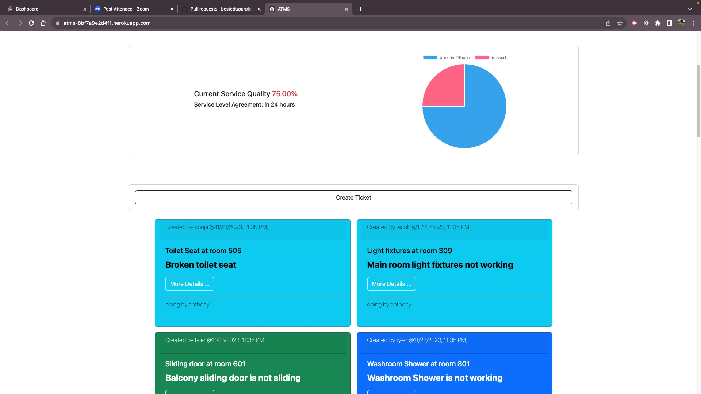
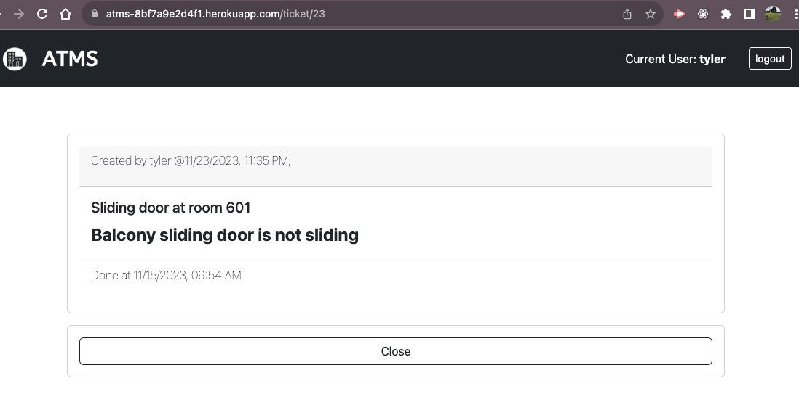

# Apartment Ticket Management System (ATMS)
By Carleton University Coding Bootcamp 2023 gourp 1 - project 2

## User Story
As a tenant/manager/superintendent 
I want an application that will track building maintenance 
so that people can easily maintain and track a apartment buildings issues 

## Acceptance Criteria
- Use Node.js and Express.js to create a RESTful API.
- Use Handlebars.js as the templating engine.
- Use MySQL and the Sequelize ORM for the database.
- Have both GET and POST routes for retrieving and adding new data.
- Be deployed using Heroku (with data).
- Use at least one new library, package, or technology that we haven’t discussed.
- Have a polished UI.
- Be responsive.
- Be interactive (i.e., accept and respond to user input).
- Have a folder structure that meets the MVC paradigm.
- Include authentication (express-session and cookies).
- Protect API keys and sensitive information with environment variables.
- Have a clean repository that meets quality coding standards (file structure, naming conventions, follows best practices for class/id naming conventions, indentation, quality comments, etc.).
- Have a quality README (with unique name, description, technologies used, screenshot, and link to deployed application).

## Screen Shots

## Deployed Link
<https://atms-8bf7a9e2d4f1.herokuapp.com/>

## instruction
### Installation
`npm install`
### seeds data
`npm run seeds`
### start application
`npm start`
### deploy to heroku
`git push heroku main`
### seeds data on heroku
`heroku run npm run seeds`